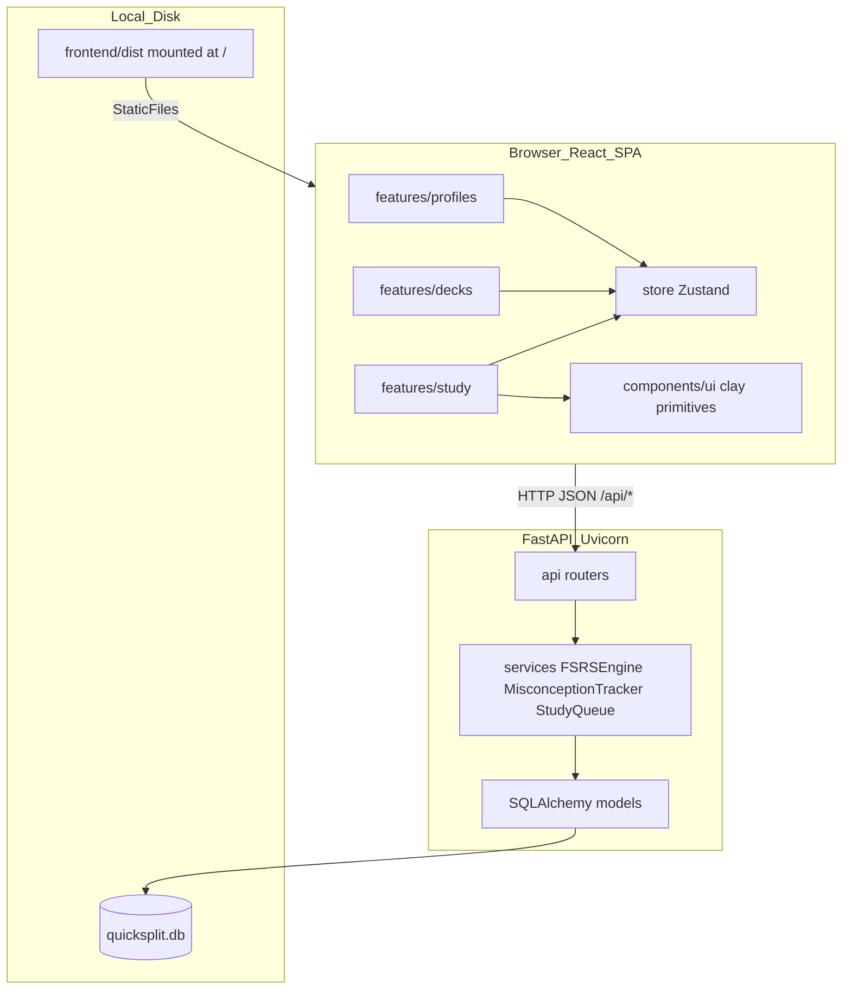
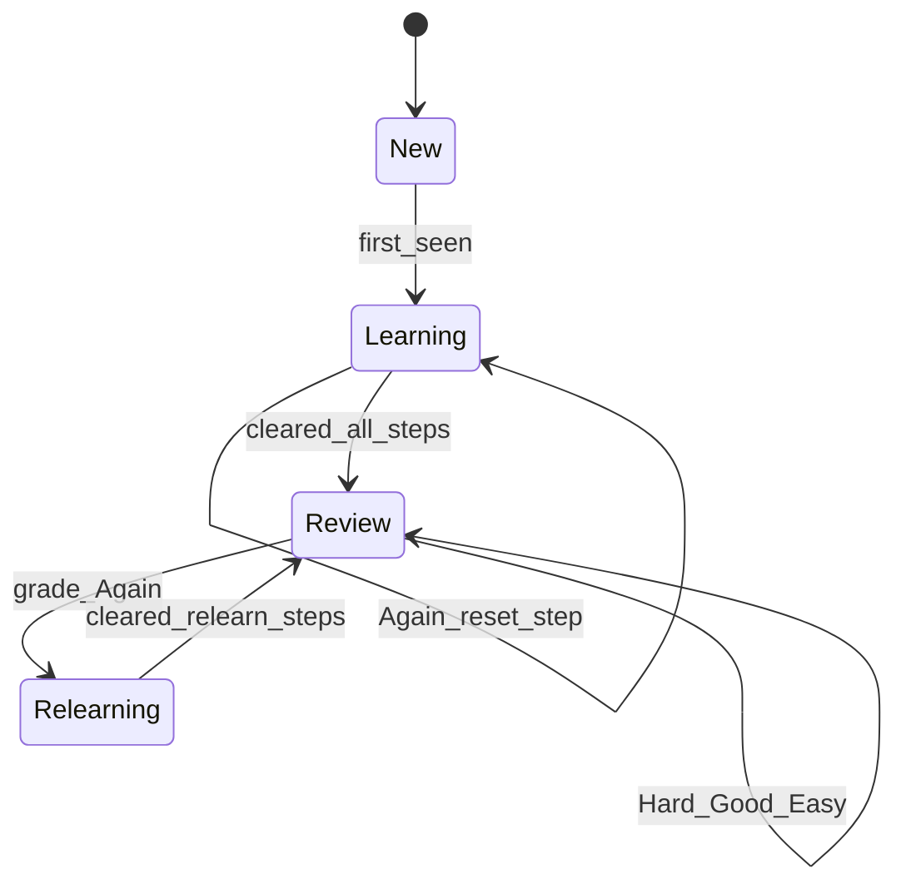

# Architectural and Pedagogical Blueprint  
## Next-Generation Adaptive Flashcard System — **QuickSplit**

**Status:** Locked specification for implementation  
**Stack decision:** React (Vite + TypeScript) frontend · FastAPI (Python) backend · SQLite  
**User model (locked):** **1B — Local multi-profile** (named profiles, no cloud auth)  
**Build depth (locked):** **2A — Full blueprint in one pass** (FSRS + learning steps + co-occurrence + clay UI + PyInstaller)  
**Repo state:** Greenfield with partial scaffolding (`frontend/` Vite app; `backend/app/` domain folders; deps already listed)

---

## 0. Executive Summary and System Vision

QuickSplit is a cross-platform adaptive flashcard product aimed primarily at **high school and college** learners, while remaining approachable for younger students. It must feel as fluid and friendly as Quizlet, but schedule reviews with modern spaced-repetition science (FSRS) and gather rich telemetry so future AI / knowledge-tracing models have training data from day one.

### Hybrid delivery model

| Layer | Technology | Role |
|-------|------------|------|
| UI | React 19 + Vite + TypeScript + Tailwind CSS v4 + Framer Motion + canvas-confetti | Bubbly claymorphic SPA in the default browser |
| API | FastAPI + Uvicorn + Pydantic V2 | REST boundary, validation, static mount of React `dist` |
| Persistence | SQLite + SQLAlchemy 2.0 (+ Alembic) | Local OO data model; zero cloud required for v1 |
| Pedagogy | `FSRSEngine` + learning-step queue | Miss → reappear in ~10–20 minutes (scales with set size), then long-term FSRS |
| Packaging | PyInstaller + `webbrowser` | Double-click / `.bat` / binary → local server → browser |

**Why React + Python (not Python-only UI):** React owns spring physics, layout animation, and investor-demo polish. Python owns FSRS math, co-occurrence matrices, and a clean path to pandas / ML later. The browser is the universal runtime; PyInstaller is the “bat-script equivalent” on every OS.

**Investor / recruiter bar:** Strict OO models, feature-driven React folders, domain-driven FastAPI routers, exhaustive comments on *why*, minimal fluff, typed boundaries (Pydantic + TypeScript), and a README that explains the demo path in under two minutes.

---

## 1. Locked Product Decisions

| Decision | Choice | Rationale |
|----------|--------|-----------|
| Auth | Local **Profile** pickers (no passwords) | Multi-learner households / study groups without OAuth scope |
| Scheduling | Learning steps **then** FSRS-5-style DSR | Satisfies “show miss again in 10–20 min” + long-term retention |
| Card types v1 | `TextCard` + `MultipleChoiceCard` (polymorphic) | Option tracing needs MC or typed answers |
| Grades | 1–4: Again / Hard / Good / Easy | FSRS standard |
| Design language | Claymorphism: **mint · peach · sky · soft butter** (avoid purple-default AI look) | Approachable for teens; brandable for demo |
| State (client) | Zustand for active profile + study session | Already in `package.json` |
| HTTP | Axios | Already in `package.json` |
| Confetti | `canvas-confetti` (GPU canvas, not DOM particles) | Already in `package.json` |
| DB path | `backend/data/quicksplit.db` | Matches existing `session.py` |

---

## 2. System Architecture



### Runtime launch sequence (packaged)

1. User runs `QuickSplit` binary / `scripts/run.bat` / `scripts/run.sh`.
2. `multiprocessing.freeze_support()` (required under PyInstaller).
3. `init_db()` ensures SQLite schema exists.
4. FastAPI mounts React build at `/` and API under `/api`.
5. Uvicorn binds `127.0.0.1:8000` (single worker).
6. `webbrowser.open("http://127.0.0.1:8000")`.

### Dev launch sequence

```bash
# terminal A
cd backend && source .venv/bin/activate && uvicorn app.main:app --reload --port 8000

# terminal B
cd frontend && npm run dev   # Vite proxies /api → :8000
```

---

## 3. Pedagogical Engine (Detailed)

### 3.1 Why not SM-2 alone

SM-2’s ease factor can enter **ease hell** (floor ~1.3) and never recover. It also over-reviews mature cards. QuickSplit uses **FSRS** (Difficulty / Stability / Retrievability) for long-term scheduling, with a separate **learning phase** for short-term encoding.

### 3.2 Card lifecycle states

| State | Meaning | Scheduler |
|-------|---------|-----------|
| `new` | Never reviewed | Learning steps |
| `learning` | In micro-interval ladder | Learning steps |
| `review` | Graduated | FSRS interval |
| `relearning` | Lapsed from review (Again) | Learning steps, then back to review |



### 3.3 Short-term learning steps (your 10–20 minute requirement)

Default base steps (minutes):

```text
LEARNING_STEPS_MIN = [1, 10, 1440]   # 1 min, 10 min, 1 day
RELEARNING_STEPS_MIN = [10]          # after a lapse from review
```

**Set-size scaling** so larger decks do not bury a miss too soon or too late:

\[
\text{scaled\_gap} = \mathrm{clamp}\big(10 + 0.15 \cdot N,\; 8,\; 25\big)
\]

where \(N\) = number of cards in the set. The **second learning step** (nominally 10 min) is replaced by `scaled_gap` minutes. Intuition: ~10 min for a 20-card set, ~20 min for a ~70-card set, capped at 25.

On **Again** during learning: `learning_step_index = 0`, schedule `now + first_step`, increment failure counters, log telemetry + co-occurrence.

On **Good/Easy** during learning: advance step; if last step cleared → graduate to FSRS with initial stability from FSRS “new card” formulas.

### 3.4 FSRS mathematical core (implement in `FSRSEngine`)

**Retrievability** (probability of recall at elapsed time \(t\) days given stability \(S\)):

\[
R(t,S) = \left(1 + \frac{19}{81}\cdot\frac{t}{S}\right)^{-w_{20}}
\]

With default \(w_{20} = 0.5\) this yields \(R(S,S) = 0.9\) (target retention).

Python sketch (authoritative implementation lives in `backend/app/services/fsrs_engine.py`):

```python
FACTOR = 19.0 / 81.0
W20 = 0.5  # FSRS weight; allow override via ProfileSettings later

def retrievability(t_days: float, stability: float) -> float:
    if stability <= 0:
        return 0.0
    return (1.0 + FACTOR * (t_days / stability)) ** (-W20)

def next_interval_days(stability: float, request_retention: float = 0.9) -> float:
    # Invert R(t,S) = R for t
    # t = (S / FACTOR) * (R^(-1/W20) - 1)
    return (stability / FACTOR) * (request_retention ** (-1.0 / W20) - 1.0)
```

**Grade mapping:** `1=Again, 2=Hard, 3=Good, 4=Easy`.

**Update rules (FSRS-5 behavior to encode):**

1. Snapshot `pre_d`, `pre_s`, `pre_r` before mutation (telemetry).
2. Update **Difficulty** \(D \in [1,10]\) from grade (Again raises D; Easy lowers D).
3. Update **Stability** \(S\):
   - Success: apply spacing effect — larger gain when \(R\) was low.
   - Failure: apply lapse stability formula; enter relearning.
4. Set `due_at = now + interval` from inverted retention curve (or learning step).
5. Persist `UserPerformance`; append `ReviewLog`.

**Do not hand-roll every FSRS weight from scratch if avoidable:** prefer encoding the published FSRS-5 weight vector as named constants with a comment citing [open-spaced-repetition/fsrs4anki](https://github.com/open-spaced-repetition/fsrs4anki), then expose `request_retention` (default `0.9`) on `ProfileSettings`. Unit-test against known fixture rows.

### 3.5 Study queue priority

When building a session for `(profile_id, set_id)`:

1. All cards with `due_at <= now` (learning + review + relearning).
2. Sort key: `(due_at ASC, fail_streak DESC, created_at ASC)`.
3. Optional session cap: `new_cards_per_day` + `reviews_per_day` from profile settings.
4. Intra-session: after an Again, **do not** show the same card as the immediate next item; insert at least `min(3, remaining_queue)` cards ahead (reduces short-term recognition cheating while still hitting the 10–20 min schedule via `due_at`).

---

## 4. Deep Knowledge Tracing and Over-Gather Telemetry

### 4.1 Option tracing / common wrong answers

For `MultipleChoiceCard`, store `choices: list[str]` and `correct_index`. On miss, log `input_given` = chosen distractor text + `selected_index`.  
For `TextCard` with `answer_mode = "exact"`, log the typed string.  
For flip-only self-grade (no typed answer), `input_given` may be null; still log grade + timings.

### 4.2 Co-occurrence matrix

Per `(profile_id, set_id)`, maintain undirected pair counts:

- On each failed review in session `S`, append `card_id` to `session.failed_card_ids`.
- At session end (or after each fail), for every unordered pair `(A,B)` of distinct fails in that session, upsert `CoOccurrenceEdge(profile_id, set_id, card_a_id, card_b_id)` with `count += 1` (store `card_a_id < card_b_id` to avoid duplicates).

Future: spectral clustering / LSTM inputs from this sparse graph — **not** implemented in v1 beyond storage + a simple “often missed with” read API.

### 4.3 Telemetry fields (over-gather now)

| Field | Type | Purpose |
|-------|------|---------|
| `id` | UUID | Primary key |
| `profile_id` | UUID | Learner |
| `card_id` | UUID | Concept |
| `set_id` | UUID | Denormalized for fast set-level analytics |
| `session_id` | UUID | Groups a continuous study run |
| `timestamp` | DateTime UTC | Time series / fatigue |
| `local_hour` | int 0–23 | Circadian patterns |
| `day_of_week` | int 0–6 | Weekly patterns |
| `duration_ms` | int | Cognitive load proxy (front shown → grade) |
| `time_to_flip_ms` | int \| null | Hesitation before reveal |
| `grade` | int 1–4 | Subjective rating |
| `was_correct` | bool | Derived: grade ≥ 3 for v1 self-grade; MC uses match |
| `input_given` | str \| null | Option tracing |
| `selected_index` | int \| null | MC distractor index |
| `card_type` | str | `text` \| `mc` |
| `scheduler_state` | str | `new`\|`learning`\|`review`\|`relearning` |
| `learning_step_index` | int \| null | Step before update |
| `pre_review_d` | float | Difficulty before |
| `pre_review_s` | float | Stability before |
| `pre_review_r` | float | Retrievability before |
| `post_review_d` | float | After |
| `post_review_s` | float | After |
| `post_review_r` | float \| null | Optional |
| `delta_s` | float | `post_s - pre_s` |
| `interval_before_days` | float \| null | |
| `scheduled_interval_days` | float | Assigned next gap |
| `due_at_before` | DateTime \| null | |
| `due_at_after` | DateTime | |
| `review_number` | int | Lifetime reviews for this pair |
| `lapse_count_before` | int | |
| `fail_streak_before` | int | Consecutive Agains |
| `queue_position` | int \| null | Position when shown |
| `cards_due_count` | int \| null | Backlog size at review time |
| `set_size` | int | \(N\) used for scaling |
| `device_class` | str \| null | `desktop`\|`mobile` from User-Agent hint |
| `app_version` | str | Semver for schema evolution |
| `client_timezone` | str \| null | IANA tz from browser |

**Session-level aggregate** (`StudySession`): `started_at`, `ended_at`, `cards_reviewed`, `again_count`, `hard_count`, `good_count`, `easy_count`, `mean_duration_ms`, `interrupted` bool.

---

## 5. Object-Oriented Backend Design

### 5.1 Class responsibilities (investor narrative)

- **`Profile`** — local learner identity.  
- **`FlashcardSet`** — the “class” container of a curriculum unit (title, description, accent color).  
- **`Flashcard`** — polymorphic base; **`TextCard`** / **`MultipleChoiceCard`** subclasses hold content.  
- **`UserPerformance`** — per `(profile, card)` FSRS + learning state (never mutate content from performance).  
- **`ReviewLog`** — immutable append-only telemetry.  
- **`StudySession`** — one continuous study run.  
- **`CoOccurrenceEdge`** — misconception graph edge.  
- **`FSRSEngine`** — pure functions / service: state in → new state out (no HTTP).  
- **`MisconceptionTracker`** — updates co-occurrence.  
- **`StudyQueueService`** — builds ordered due list.

### 5.2 SQLAlchemy models (fields)

```text
Profile
  id: UUID PK
  display_name: str(80)
  avatar_emoji: str(8) | null     # keep optional; prefer soft avatar color
  accent_hue: str                 # e.g. "mint" | "peach" | "sky"
  created_at, updated_at
  settings: relationship ProfileSettings (1:1)

ProfileSettings
  profile_id: UUID FK PK
  request_retention: float = 0.9
  learning_steps_json: str        # default "[1,10,1440]"
  new_cards_per_day: int = 20
  reviews_per_day: int = 200
  show_timer: bool = True

FlashcardSet
  id: UUID PK
  title: str
  description: str
  accent: str                     # clay color token
  owner_profile_id: UUID FK | null  # who created it; all profiles may study
  card_count: int                 # denormalized cache
  created_at, updated_at

Flashcard  (polymorphic)
  id: UUID PK
  set_id: UUID FK
  card_type: str                  # discriminator: "text" | "mc"
  front: str
  back: str                       # canonical answer / explanation
  hint: str | null
  tags_json: str | null
  position: int                   # editor order
  created_at, updated_at
  # TextCard extra: answer_mode ("flip"|"exact"), acceptable_answers_json
  # MultipleChoiceCard extra: choices_json, correct_index

UserPerformance
  id: UUID PK
  profile_id + card_id UNIQUE
  state: str
  difficulty: float               # D
  stability: float                # S
  retrievability: float           # cached R at last review
  learning_step_index: int
  reps: int
  lapses: int
  fail_streak: int
  last_review_at: DateTime | null
  due_at: DateTime
  last_grade: int | null

StudySession / ReviewLog / CoOccurrenceEdge
  — as telemetry section
```

### 5.3 Pydantic V2 schemas

Mirror models with `model_config = ConfigDict(from_attributes=True)`. Separate `Create` / `Update` / `Read` schemas. Never leak internal FSRS weights in list endpoints unless `?debug=1`.

---

## 6. REST API Contract

Base: `/api/v1`

| Method | Path | Purpose |
|--------|------|---------|
| GET | `/profiles` | List local profiles |
| POST | `/profiles` | Create profile |
| PATCH | `/profiles/{id}` | Rename / accent |
| DELETE | `/profiles/{id}` | Soft-delete or hard-delete with cascade performance |
| GET | `/profiles/{id}/settings` | |
| PATCH | `/profiles/{id}/settings` | |
| GET | `/sets` | All sets (+ due counts for active profile header) |
| POST | `/sets` | Create set |
| GET | `/sets/{id}` | Set + cards |
| PATCH | `/sets/{id}` | |
| DELETE | `/sets/{id}` | |
| POST | `/sets/{id}/cards` | Add card |
| PATCH | `/cards/{id}` | Edit card |
| DELETE | `/cards/{id}` | |
| POST | `/study/sessions` | Body: `{profile_id, set_id}` → session + first queue |
| GET | `/study/sessions/{id}/queue` | Remaining due cards |
| POST | `/study/reviews` | Submit grade + telemetry; returns next card + updated performance |
| POST | `/study/sessions/{id}/end` | Finalize session; flush co-occurrence |
| GET | `/analytics/sets/{id}/cooccurrence` | Sparse edges for future UI |
| GET | `/health` | Liveness |

### `POST /study/reviews` body

```json
{
  "session_id": "uuid",
  "profile_id": "uuid",
  "card_id": "uuid",
  "grade": 3,
  "duration_ms": 4200,
  "time_to_flip_ms": 1800,
  "input_given": null,
  "selected_index": null,
  "client_timezone": "America/New_York",
  "queue_position": 2,
  "device_class": "desktop"
}
```

Response includes: `performance`, `next_card | null`, `session_stats`, `celebrated: bool` (queue empty).

---

## 7. React Frontend Architecture (Feature-Driven)

### 7.1 Complete folder tree (target)

```text
quicksplit/
├── README.md
├── docs/
│   └── ARCHITECTURE_BLUEPRINT.md          # this file
├── scripts/
│   ├── run.sh                             # dev: start api + open browser
│   ├── run.bat
│   └── build_executable.sh
├── frontend/
│   ├── index.html
│   ├── package.json
│   ├── vite.config.ts                     # proxy /api → :8000; Tailwind plugin
│   ├── tsconfig*.json
│   ├── public/
│   │   └── favicon.svg
│   └── src/
│       ├── main.tsx
│       ├── index.css                      # @theme clay tokens
│       ├── app/
│       │   ├── AppRouter.tsx              # react-router routes
│       │   ├── providers.tsx              # Query/error boundaries if added
│       │   └── routes.ts
│       ├── components/
│       │   └── ui/
│       │       ├── ClayButton.tsx
│       │       ├── ClayCard.tsx
│       │       ├── ClayInput.tsx
│       │       ├── ClayModal.tsx
│       │       ├── ClayChip.tsx
│       │       └── ProgressBubbles.tsx
│       ├── features/
│       │   ├── profiles/
│       │   │   ├── api.ts
│       │   │   ├── types.ts
│       │   │   ├── ProfilePickerPage.tsx
│       │   │   └── CreateProfileModal.tsx
│       │   ├── decks/
│       │   │   ├── api.ts
│       │   │   ├── types.ts
│       │   │   ├── HomePage.tsx           # grid of sets + “New set”
│       │   │   ├── SetDetailPage.tsx      # list/edit cards, Study CTA
│       │   │   ├── SetEditorForm.tsx
│       │   │   └── CardEditorRow.tsx
│       │   └── study/
│       │       ├── api.ts
│       │       ├── types.ts
│       │       ├── StudyPage.tsx
│       │       ├── FlippingCard.tsx       # 3D Y-flip spring
│       │       ├── GradeBar.tsx           # Again Hard Good Easy
│       │       ├── SessionProgress.tsx
│       │       └── useStudySession.ts
│       ├── lib/
│       │   ├── apiClient.ts               # axios instance
│       │   └── time.ts
│       ├── store/
│       │   ├── profileStore.ts
│       │   └── studyStore.ts
│       └── assets/
│           └── brand/                     # soft gradients, mascot optional
├── backend/
│   ├── requirements.txt
│   ├── build.spec                         # PyInstaller
│   ├── alembic.ini
│   ├── alembic/
│   │   └── versions/
│   ├── data/                              # gitignored sqlite
│   ├── static/                            # copied frontend dist for package
│   └── app/
│       ├── __init__.py
│       ├── main.py                        # FastAPI app + static mount + freeze_support entry
│       ├── config.py
│       ├── api/
│       │   ├── __init__.py
│       │   ├── deps.py                    # get_db, active profile headers
│       │   ├── profiles.py
│       │   ├── sets.py
│       │   ├── study.py
│       │   └── analytics.py
│       ├── db/
│       │   ├── session.py                 # exists
│       │   └── init_db helpers
│       ├── models/
│       │   ├── __init__.py                # export all
│       │   ├── profile.py
│       │   ├── flashcard_set.py
│       │   ├── flashcard.py               # polymorphic
│       │   ├── performance.py
│       │   ├── review_log.py
│       │   ├── study_session.py
│       │   └── cooccurrence.py
│       ├── schemas/
│       │   ├── profile.py
│       │   ├── flashcard.py
│       │   ├── study.py
│       │   └── common.py
│       └── services/
│           ├── fsrs_engine.py
│           ├── learning_steps.py          # set-size scaling
│           ├── misconception_tracker.py
│           ├── study_queue.py
│           └── review_pipeline.py         # orchestrates grade → log → matrix → next
```

### 7.2 Routes (UX flow)

| Path | Screen |
|------|--------|
| `/` | Profile picker (if none active) or redirect home |
| `/home` | All sets grid + Add set |
| `/sets/:id` | Set detail: smooth card list, edit, Study |
| `/sets/:id/study` | Active study session |
| `/settings` | Active profile settings (retention, daily caps) |

### 7.3 Claymorphism design tokens (Tailwind v4 `@theme`)

Avoid sterile enterprise gray and avoid default “AI purple.” Use:

```css
@theme {
  --color-canvas: #e8f6f1;          /* soft mint wash */
  --color-canvas-2: #fff6eb;        /* peach wash for gradient */
  --color-ink: #1f2a2e;
  --color-muted: #5b6b70;
  --color-mint: #7dcbbe;
  --color-peach: #f0b7a0;
  --color-sky: #8ec5e8;
  --color-butter: #f6e7a9;
  --shadow-clay: 8px 8px 20px rgba(31, 42, 46, 0.12),
                 inset -5px -5px 12px rgba(31, 42, 46, 0.08),
                 inset 5px 5px 12px rgba(255, 255, 255, 0.85);
  --radius-clay: 1.75rem;
}
```

Background: soft diagonal / radial gradient mint→butter (not flat white).  
Hero of home: product name **QuickSplit** at brand scale; one line of support copy; primary CTA “Study due cards” / “New set”. First viewport is one composition — not a dashboard of stats.

**Motion budget (ship ≥3):**

1. FlippingCard spring `rotateY`.  
2. Layout animation when card exits queue.  
3. ClayButton press scale (`whileTap={{ scale: 0.96 }}`).  
4. Confetti on session complete (canvas).

### 7.4 `FlippingCard` contract

```tsx
type FlippingCardProps = {
  front: string;
  back: string;
  hint?: string;
  disabled?: boolean;
  onFlip?: (flipped: boolean) => void;
};
```

Implementation notes:

- Parent `perspective: 1000px`.  
- Two faces absolutely stacked; `backfaceVisibility: "hidden"`; back face `rotateY(180deg)`.  
- Tap / Space flips; grades only enabled after flip (except optional “Again” always available for power users — default: require flip).  
- Measure `time_to_flip_ms` and `duration_ms` in `useStudySession`.

---

## 8. Coding Standards (recruiter-facing)

1. **Python:** type hints everywhere; docstrings on public classes stating *responsibility*; no dead code; `ruff`-friendly.  
2. **TypeScript:** strict mode; feature-local types; no `any`.  
3. **Comments:** explain non-obvious pedagogy / PyInstaller pitfalls; do not narrate obvious syntax.  
4. **OO:** services are classes or modules with clear single responsibility; routers stay thin.  
5. **Tests:**  
   - `backend/tests/test_fsrs_engine.py` — retrievability at t=S equals ~0.9; Again resets learning step; set-size clamp.  
   - `backend/tests/test_cooccurrence.py` — pair ordering + increment.  
   - Frontend: optional Vitest for grade mapping later.

---

## 9. Phased Implementation Plan (2A — Full Pass)

Execute **in order**. Do not start Phase N+1 until Phase N acceptance checks pass.

### Phase 0 — Cleanup & monorepo hygiene

- Remove misplaced `frontend/backend/` venv if present; keep only `backend/.venv`.  
- Root `.gitignore`: `node_modules`, `.venv`, `backend/data/*.db`, `dist`, `static`, PyInstaller `build/`.  
- Root `README.md` with 60-second demo script.

**Accept:** `git status` clean of secrets; both apps install.

### Phase 1 — Backend models + Alembic

- Implement all ORM classes; `models/__init__.py` imports all.  
- Alembic initial migration **or** `init_db()` for v1 with documented upgrade path.  
- Pydantic schemas for profiles/sets/cards.

**Accept:** create profile + set + text card via Python REPL / temporary route.

### Phase 2 — FSRS + learning steps + misconception services

- `learning_steps.py` scaling formula with unit tests.  
- `FSRSEngine.review(state, grade, now) -> new_state`.  
- `MisconceptionTracker.record_failures(session_id)`.  
- `review_pipeline.py` transactional orchestration.

**Accept:** pytest green for engine + co-occurrence.

### Phase 3 — REST API

- Wire routers; CORS for Vite origin in dev.  
- Study endpoints return queue + review mutation side effects.

**Accept:** curl/httpie script completes a 3-card Again/Good loop; DB shows `ReviewLog` rows.

### Phase 4 — React shell + clay primitives

- Tailwind v4 theme tokens; `ClayButton`, `ClayCard`, `ClayInput`.  
- React Router; Zustand profile store persisted in `localStorage`.  
- Vite proxy `/api`.

**Accept:** profile create/select UI works against live API.

### Phase 5 — Decks feature

- Home grid; set detail; add/edit/delete cards; motion on list layout.

**Accept:** full CRUD without refresh bugs.

### Phase 6 — Study feature

- `StudyPage` + `FlippingCard` + `GradeBar` + confetti.  
- Telemetry fields populated from client timers.

**Accept:** miss schedules ~scaled minutes; Good advances; session end confetti; co-occurrence rows after multi-fail session.

### Phase 7 — Packaging

- `npm run build` → copy to `backend/static`.  
- `main.py` StaticFiles + SPA fallback.  
- PyInstaller `build.spec` with `freeze_support`, one worker.  
- `scripts/run.bat` / `run.sh` for unpackaged local demo.

**Accept:** double-click (or script) opens browser; study works offline.

---

## 10. Sample Domain Narrative (demo for investors)

1. Create profiles **“Alex”** and **“Sam”**.  
2. Create set **“AP Biology — Cell Transport”** with 12 cards (mix text + MC).  
3. Alex studies; fails “osmosis” and “hypertonic” in the same session → co-occurrence edge increments.  
4. Osmosis returns after ~12 minutes (scaled).  
5. After graduation, intervals stretch via FSRS; Alex’s performance never overwrites Sam’s.

---

## 11. Future Work (schema already ready)

- Parameter personalization (optimize FSRS weights per profile).  
- Remedial card generation from CWA clusters.  
- Cloud sync / OAuth (upgrade path from Profile → Account).  
- Shared classroom sets.  
- LSTM / DKT models trained on `ReviewLog` exports (CSV/Parquet dump endpoint).

---

## 12. Implementation Guardrails for Coding Agents

1. Prefer editing existing scaffold (`session.py`, Vite app) over rewriting tools.  
2. Keep routers thin; put math in `services/`.  
3. Never use Electron for v1.  
4. Never block the UI thread with confetti DOM nodes.  
5. Always write `ReviewLog` **before** returning the HTTP response (same transaction as performance update).  
6. Store UUIDs as strings in SQLite for portability.  
7. Comment every pedagogical constant with its unit (minutes vs days).  
8. Match clay palette tokens — no purple-primary theme.

---

## 13. Quick Reference: Learning Gap Formula

```python
def scaled_requeue_minutes(set_size: int) -> int:
    """Miss reappear gap: ~10–20 minutes, scales with set size."""
    raw = 10.0 + 0.15 * set_size
    return int(max(8, min(25, round(raw))))
```

| Set size N | Gap (min) |
|------------|-----------|
| 10 | 12 |
| 20 | 13 |
| 40 | 16 |
| 67 | 20 |
| 100+ | 25 (cap) |

---

*End of locked blueprint. Implement via Phases 0–7 without changing 1B/2A decisions unless a new product owner revision is issued.*
